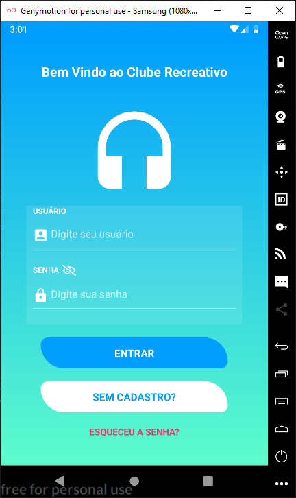
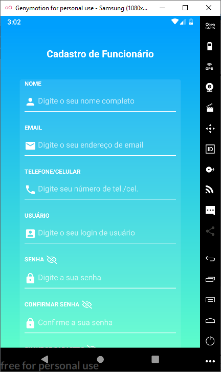
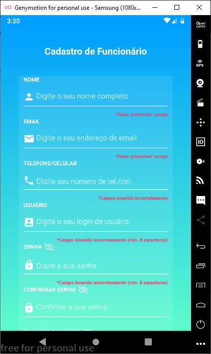
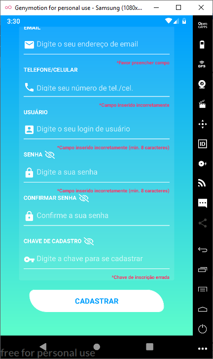
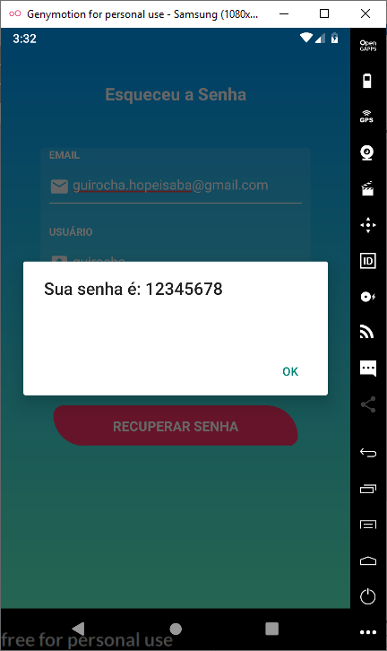
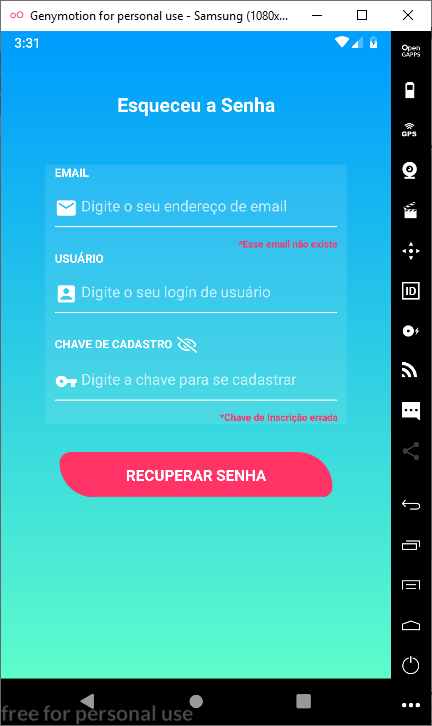
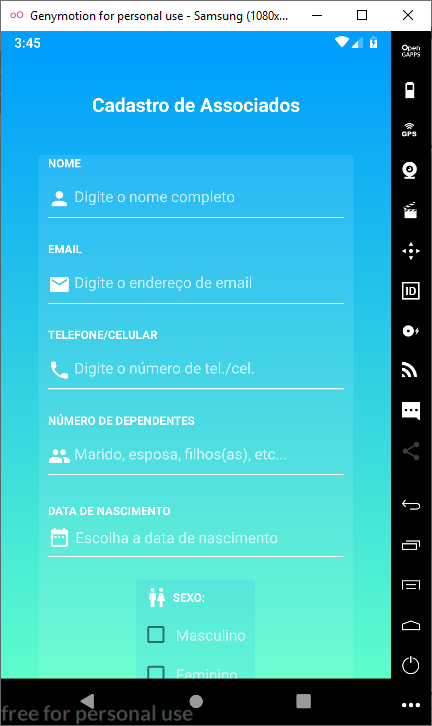
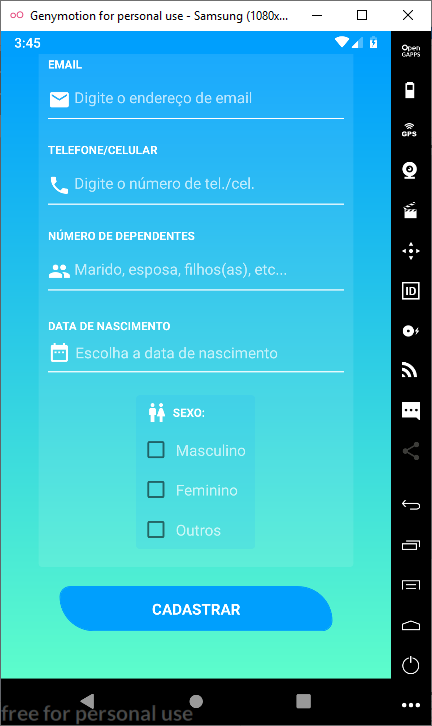

# Aplicativo de Gerenciamento de um Clube Recreativo

## Tela de Login

A tela de login é onde fica a validação de usuário e senha do funcionário, caso ele não tenha esses dados, ele pode clicar no botão "SEM CADASTRO?" para criar um novo cadastro, e caso tenha esquecido a sua senha, ele pode clicar em "ESQUECEU A SENHA?" para recuperar a mesma.

  

Além disso ao tentar entrar, ele verifica se o usuário existe, caso não exista, ele exibe uma mensagem de erro.

  

E se o usuário existe, ele verifica se a senha está correta e vai para a tela principal, caso contrário ele exibe uma mensagem de erro.

  

## Tela de Cadastro de Funcionário

Essa tela é utilizada para cadastrar novos funcionários, caso eles não tenham seu registro no banco ainda.

  
  

Ela também verifica erros de input do usuário antes de cadastrá-lo.

  
  

## Tela de Recuperar Senha

Essa tela é utilizada para recuperar a senha do funcionário através do seu email, usuário e chave de cadastro.

  

Se os dados digitados estiverem corretos, ele exibe uma mensagem com a senha do usuário.

  

Caso contrário, ela exibe os erros de input.

  

## Tela Principal

Na tela principal é onde o usuário poderá cadastrar, listar, atualizar e remover os associados que frequentam o clube, além da tela sobre com informações minímas da aplicação. 

  

## Tela de Cadastro de Associados

Aqui é onde os associados são cadastrados, com campos para inserir nome, email, telefone, número de dependentes (parentes), data de nascimento e sexo.

  
  

Ele também faz a verificação de dados antes de realizar o cadastro do associado.

  
  

## Tela de Listar Associados

Essa tela faz a listagem dos associados cadastrados no clube.

  

Também é possível pesquisar pelo nome dos associados existentes para mostrar na listagem, além de listar todos que já existem clicando no botão "LISTAR TODOS OS ASSOCIADOS".

  

## Tela de Atualizar Associados

Essa tela é utilizada para atualizar o cadastro dos associados, além de ser capaz de pesquisar e listar os associados, assim como na tela de listar associados, e para atualizar os dados, basta clicar no botão "ATUALIZAR" do cadastro desejado, mandando esses dados para serem editados na tela de editar associados.

  

## Tela de Editar Associados

Essa tela atualiza os dados que foram mandados da tela de atualizar associados, além de poder atualizar o número de visitas do associado.

  
  

## Tela de Remover Associados

## Tela Sobre

Essa tela contém a informação sobre os desenvolvedores e a versão do projeto.

  

