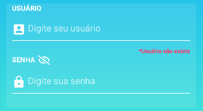
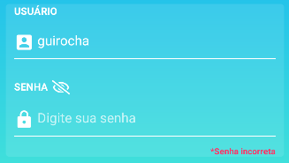
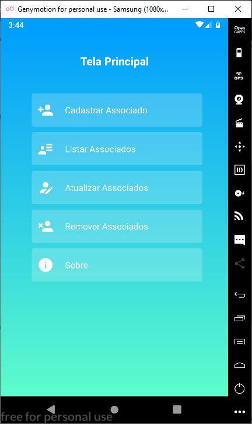
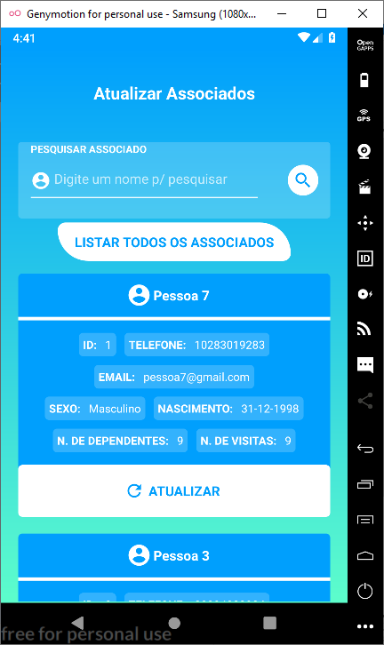
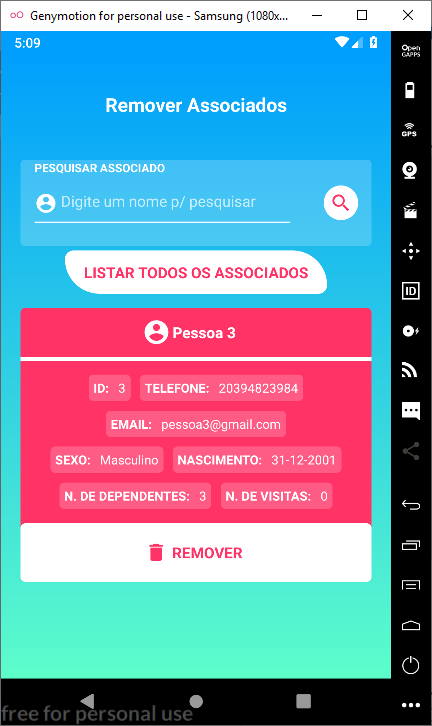

<p align="center">
  

  
  
  <a href="https://github.com/grochavieira/RecreationalClub/commits/master">
    
  </a>
    
   

   <a href="https://github.com/grochavieira">
    
  </a>
  
 
</p>
<h1 align="center">
    Recreational Club
</h1>

<h4 align="center"> 
	🚧  Mobile completo 🚧
</h4>

## 🏁 Tópicos

<p>
 👉<a href="#-sobre-o-projeto" style="text-decoration: none; "> Sobre</a> <br/>
👉<a href="#-funcionalidades" style="text-decoration: none; "> Funcionalidades</a> <br/>
👉<a href="#-layout" style="text-decoration: none"> Layout</a> <br/>
👉<a href="#-como-executar-o-projeto" style="text-decoration: none"> Como executar</a> <br/>
👉<a href="#-tecnologias" style="text-decoration: none"> Tecnologias</a> <br/>
👉<a href="#-contribuidores" style="text-decoration: none"> Contribuidores</a> <br/>
👉<a href="#-autor" style="text-decoration: none"> Autor</a> <br/>
👉<a href="#user-content--licença" style="text-decoration: none"> Licença</a>

</p>

## 💻 Sobre o projeto

<p align="justify">
  Esse aplicativo foi desenvolvido com o intuito de criar um app para o gerenciamento de cadastro de associados que frequentam um clube recreativo. Para o desenvolvimento desta aplicação, foi utilizada a linguagem Javascript em conjunto com o framework React Native para desenvolvimento mobile, e para guardar os dados do banco, foi utilizado a biblioteca RealmDB que utiliza o próprio armazenamento do celular.
</p>

---

<a name="-funcionalidades"></a>

## ⚙️ Funcionalidades

- [ ] - [ ]
  - [ ]
  - [ ]

- [ ] - [ ]
  - [ ]

---

## 🎨 Layout

## Tela de Login

A tela de login é onde fica a validação de usuário e senha do funcionário, caso ele não tenha esses dados, ele pode clicar no botão "SEM CADASTRO?" para criar um novo cadastro, e caso tenha esquecido a sua senha, ele pode clicar em "ESQUECEU A SENHA?" para recuperar a mesma.

<p align="center">
  
</p>

Além disso ao tentar entrar, ele verifica se o usuário existe, caso não exista, ele exibe uma mensagem de erro.

<p align="center">
  
</p>

E se o usuário existe, ele verifica se a senha está correta e vai para a tela principal, caso contrário ele exibe uma mensagem de erro.

<p align="center">
  
</p>

## Tela de Cadastro de Funcionário

Essa tela é utilizada para cadastrar novos funcionários, caso eles não tenham seu registro no banco ainda.

<p align="center">
  
  
</p>

Ela também verifica erros de input do usuário antes de cadastrá-lo.

<p align="center">
  
  
</p>

## Tela de Recuperar Senha

Essa tela é utilizada para recuperar a senha do funcionário através do seu email, usuário e chave de cadastro.

<p align="center">
  
</p>

Se os dados digitados estiverem corretos, ele exibe uma mensagem com a senha do usuário.

<p align="center">
  
</p>

Caso contrário, ela exibe os erros de input.

<p align="center">
  
</p>

## Tela Principal

Na tela principal é onde o usuário poderá cadastrar, listar, atualizar e remover os associados que frequentam o clube, além da tela sobre com informações minímas da aplicação.

<p align="center">
  
</p>

## Tela de Cadastro de Associados

Aqui é onde os associados são cadastrados, com campos para inserir nome, email, telefone, número de dependentes (parentes), data de nascimento e sexo.

<p align="center">
  
  
</p>

Ele também faz a verificação de dados antes de realizar o cadastro do associado.

<p align="center">
  
  
</p>

## Tela de Listar Associados

Essa tela faz a listagem dos associados cadastrados no clube.

<p align="center">
  
</p>

Também é possível pesquisar pelo nome dos associados existentes para mostrar na listagem, além de listar todos que já existem clicando no botão "LISTAR TODOS OS ASSOCIADOS".

<p align="center">
  
</p>

## Tela de Atualizar Associados

Essa tela é utilizada para atualizar o cadastro dos associados, além de ser capaz de pesquisar e listar os associados, assim como na tela de listar associados, e para atualizar os dados, basta clicar no botão "ATUALIZAR" do cadastro desejado, mandando esses dados para serem editados na tela de editar associados.

<p align="center">
  
</p>

## Tela de Editar Associados

Essa tela atualiza os dados que foram mandados da tela de atualizar associados, além de poder atualizar o número de visitas do associado.

<p align="center">
  
  
</p>

E ao atualizar ele volta para a tela de atualizar e lista novamente todos os cadastros.

<p align="center">
  
</p>

## Tela de Remover Associados

Essa tela remove os dados dos associados que foram cadastrados, além de pesquisar e listar os cadastros existentes, assim como a tela de listar e atualizar.

<p align="center">
  
</p>

Ao clicar no botão "REMOVER", ela mostra uma mensagem de confirmação para deletar o cadastro. Clicando em SIM, ele deleta o cadastro, e em NÃO ele cancela a exclusão.

<p align="center">
  
</p>

Assim o cadastro é excluido.

<p align="center">
  
</p>

## Tela Sobre

Essa tela contém a informação sobre os desenvolvedores e a versão do projeto.

<p align="center">
  
</p>

---

## 🚀 Como executar o projeto

Este projeto contém apenas uma parte:

1. Frontend (pasta mobile)

### Pré-requisitos

Antes de começar, você vai precisar ter instalado em sua máquina as seguintes ferramentas:
[Git](https://git-scm.com), [Node.js](https://nodejs.org/en/) e [Yarn](https://classic.yarnpkg.com/en/docs/install).
Além disto é bom ter um editor para trabalhar com o código como [VSCode](https://code.visualstudio.com/)

#### 🧭 Rodando a aplicação mobile (Frontend)

```bash

# Clone este repositório
$ git clone https://github.com/grochavieira/RecreationalClub.git

# Acesse a pasta do projeto no seu terminal/cmd
$ cd RecreationalClub

# Vá para a pasta da aplicação mobile
$ cd mobile

# Instale as dependências
$ yarn install

# Execute a aplicação em modo de desenvolvimento
$ react-native run-android

# Lembre-se de conectar o celular, ou inicializar a simulação, no computador antes de executar o comando acima!!!

```

---

## 🛠 Tecnologias

As seguintes ferramentas foram usadas na construção do projeto:

#### **Mobile** ([React Native](https://reactnative.dev/))

- **[React Navigation](https://reactnavigation.org/)**
- **[React Native Linear Gradient](https://github.com/react-native-community/react-native-linear-gradient)**
- **[React Native Date Picker](https://github.com/xgfe/react-native-datepicker)**
- **[Realm](https://realm.io/blog/introducing-realm-react-native/)**

> Veja o arquivo [package.json](https://github.com/grochavieira/RecreationalClub/blob/master/mobile/package.json)

#### **Utilitários**

- Editor: **[Visual Studio Code](https://code.visualstudio.com/)** → Extensions: **[SQLite](https://marketplace.visualstudio.com/items?itemName=alexcvzz.vscode-sqlite)**
- Ícones: **[Font Awesome 5](https://fontawesome.com/)**, **[Ionicons](https://ionicons.com/)**, **[Ant Design](https://ant.design/components/icon/)**, **[Material Icons](https://material.io/resources/icons/?style=baseline)**, **[Material Community Icons](https://materialdesignicons.com/)**

---

<a name="-autor"></a>

## 👨🏽‍💻 **Contribuidores**

<table>
  <tr>
    <td align="center"><a href="https://github.com/thomasafc"><br /><sub><b> Thomas Anderson </b></sub></a><br /><a href="https://github.com/thomasafc" title="Github">🦸‍♂️</a></td>
    <td align="center"><a href="https://github.com/victor-m302"><br /><sub><b> Victor Masumoto </b></sub></a><br /><a href="https://github.com/victor-m302 " title="Github">🦸‍♂️</a></td>

  </tr>
</table>

---

## 🦸‍♂️ **Autor**

<p>
<kbd>
 
 </kbd>
 <br />
 <sub><strong>🌟 Guilherme Rocha Vieira 🌟</strong></sub>
</p>

[](https://www.linkedin.com/in/grochavieira/)
[](mailto:guirocha.hopeisaba@gmail.com)

---

## 📝 Licença

Este projeto esta sobe a licença [MIT](./LICENSE).

Feito com :satisfied: por Guilherme Rocha Vieira 👋🏽 [Entre em contato!](https://www.linkedin.com/in/grochavieira/)

---
